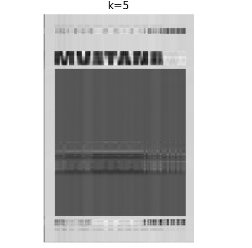

# image-compression-using-svd
using single value decompositions to reduce image size
# Image Compression using Singular Value Decomposition (SVD)

## Overview
This project demonstrates image compression using Singular Value Decomposition (SVD).
SVD decomposes an image matrix into three matrices, allowing reconstruction using only the most significant singular values. By keeping fewer singular values, the image can be approximated while reducing storage requirements.

## Mathematical Concept
For an image matrix A:
A = U Σ Vᵀ

Where:
* **U** = left singular vectors
* **Σ** = diagonal matrix of singular values
* **Vᵀ** = right singular vectors

By keeping only the top **k singular values**, we reconstruct an approximation of the original image.

## Features
* Convert image to grayscale matrix
* Apply Singular Value Decomposition
* Reconstruct compressed images using different k values
* Compare compression levels visually
* Calculate storage reduction percentage

## Technologies Used
* Python
* NumPy
* Matplotlib
* Pillow (PIL)

## Example Compression Levels
The program reconstructs the image using different values of k:
* k = 5
* k = 20
* k = 50
* k = 100
Lower k values give higher compression but lower image quality.

## How to Run
Install dependencies:
pip install numpy matplotlib pillow

Run the program:
python jackfruit.py
Make sure the input image (e.g., `mustang.jpeg`) is in the same directory.

## Output
## Results

### Original Image

### k = 5

### k = 20

### k = 50

### k = 100

### terminal output

## Learning Concepts
* Linear Algebra
* Singular Value Decomposition
* Image matrix representation
* Dimensionality reduction
* Lossy compression techniques

## Future Improvements
* Support color image compression
* Allow user-defined compression level
* Save compressed images automatically
